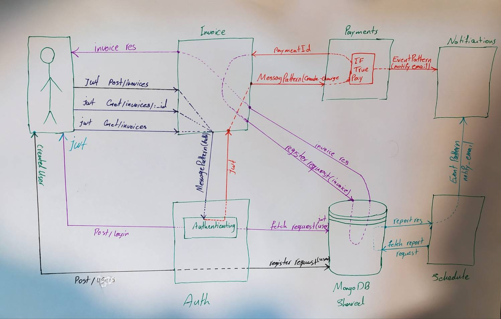

<h1 align="center">Invoice App (backend)</h1>
<h4>powerd by Nestjs  Microservices.</h4>


<br/>

## Description (** important **)

If you are using Windows, you may run into issues running the project in Docker & using hot-reloading. This is because since we are using a Linux-based image to run the project, we also need to build the project in a Linux environment.

Please refer to the following article to enable WSL2 on Windows using Docker Desktop: https://docs.docker.com/desktop/windows/wsl/

Once enabled, you can install Ubuntu from the Microsoft Store, and then run the project through Ubuntu. Make sure to rebuild the project by running docker-compose up --build

Finally - make sure your application (the physical directory on your filesystem) is inside the WSL2 filesystem, not the Windows filesystem: https://www.howtogeek.com/426749/how-to-access-your-linux-wsl-files-in-windows-10/

## Project setup and run the project

```bash
# [Development mode]: 
0) $ npm install -g pnpm  # only once required
1) $ pnpm run start:docker:dev

# [Production mode]: 
0) $ npm install -g pnpm  # only once required
1) $ pnpm run start:docker:prod
```

## Run tests

```bash
# unit test
0) $ npm install -g pnpm  # only once required
1) $ pnpm run test:unit


# e2e tests
0) $ npm install -g pnpm  # only once required
2) $ pnpm run test:e2e
```

## Resources

- [NestJS Documentation](https://docs.nestjs.com).
- [Udemy - NestJS Microservices: Build & Deploy a Scaleable Backend](https://www.udemy.com/course/nestjs-microservices-build-deploy-a-scaleable-backend/?srsltid=AfmBOoodYUee_ffVSgqwGik05pmBgnQ0lIOh_Y9Y_njR1y59Bi6bOc1q).


## Support

parastar.mehdi@gmail.com

## Stay in touch

- Author - [Mehdi Parastar](parastar.mehdi@gmail.com)
- Linkedin - [profile](https://www.linkedin.com/in/mehdi-parastar-a7567516b/)


## License

[MIT licensed](https://github.com/nestjs/nest/blob/master/LICENSE).


## UML
<p align="center">
  <a href="" target="blank"></a>
</p>
